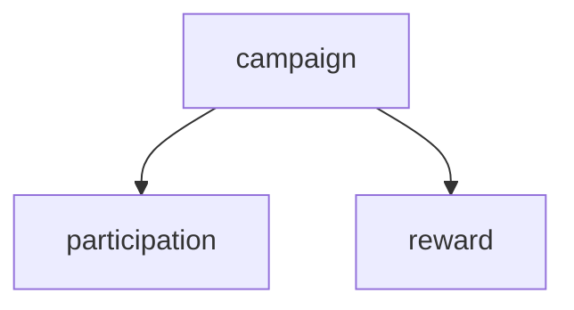
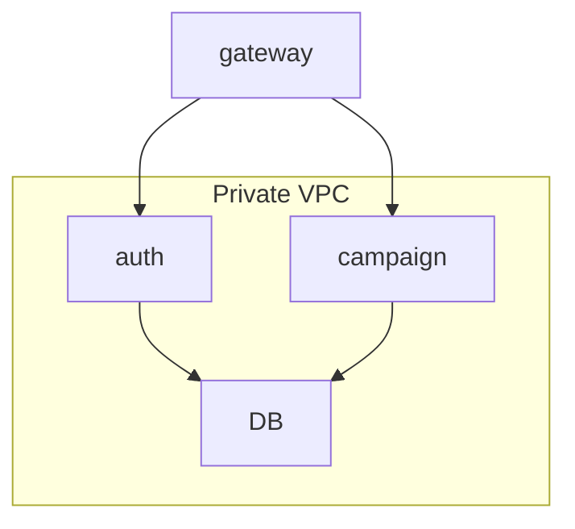

### 설계 설명

gateway

- gateway 서버는 db 에 접근하지 않고 서버를 올립니다.
- gateway 외 서버는 private vpc 안에 있도록 설정 합니다.

auth 설명

- 토큰을 관리 할수 있는 authentication 테이블에서 관리
- 계정에 대한 관리는 account 테이블에서 관리

campaign

- event 네이밍은 이미 nest js 에서 제공하느 모듈이 존재해서 네이밍 변경
- reward 와 1:1 대응으로 생성



이벤트에 대한 검증

- auth entity 에 값이 존재 한다는 가정하에 개발을 했습니다.

```json
  // 마지막 로그인 시간
  @Prop()
  lastLoginAt?: Date;

  // 달성한 업적 목록
  @Prop()
  achievements: string[];

  // 초대 친구 카운트
  @Prop()
  invitedFriendCount: number;
```

### 설계



### 실행 방법

```json
docker-compose up
```

초기 데이터

```json
npm run seed
```

각 서버에서 실행

```json
npm run start:dev
```

### 실행 위치

```
gateway port
http://localhost:3000
auth port
http://localhost:3001
campaign
http://localhost:3002
```
